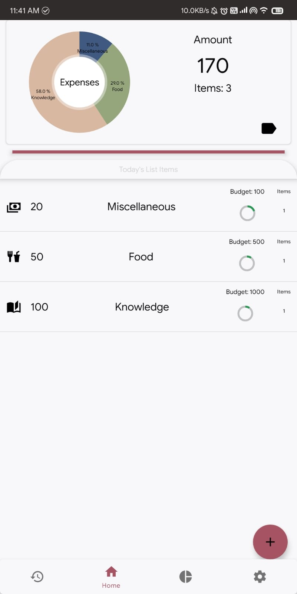
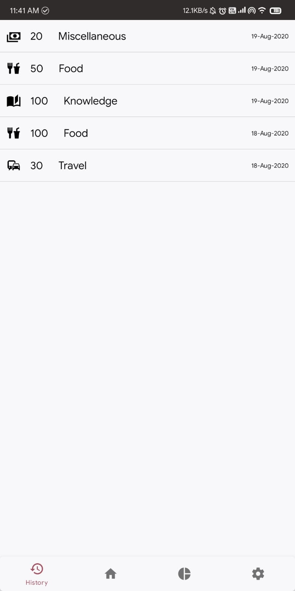
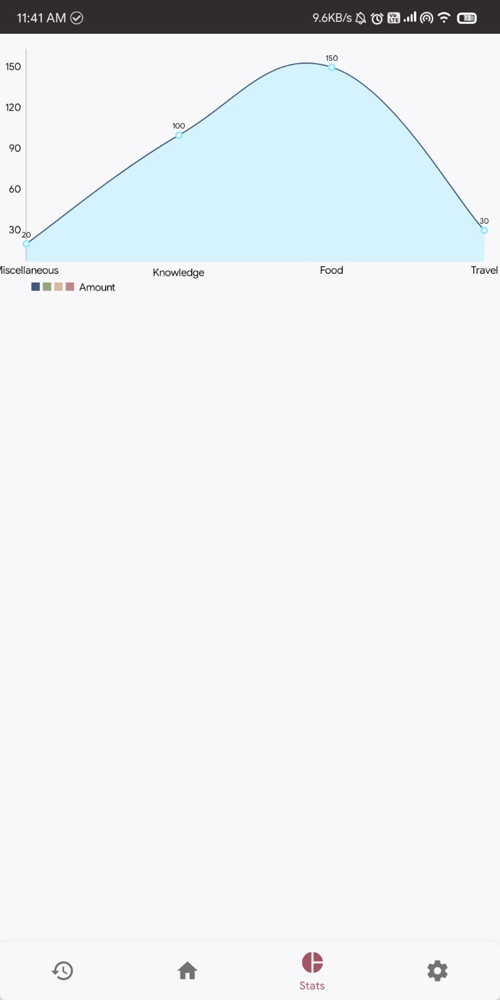
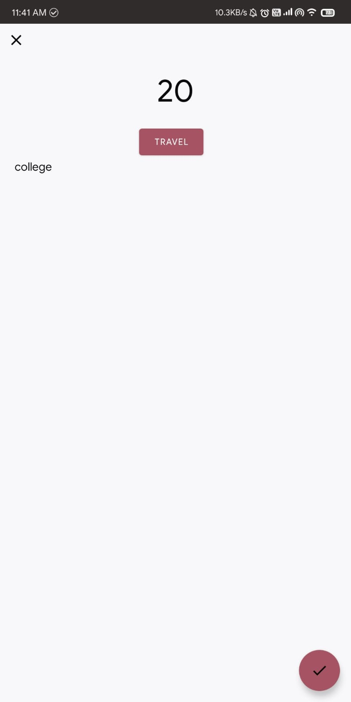
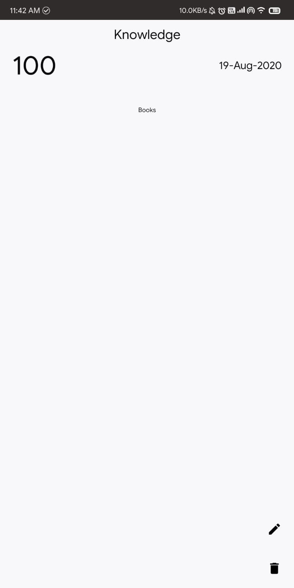
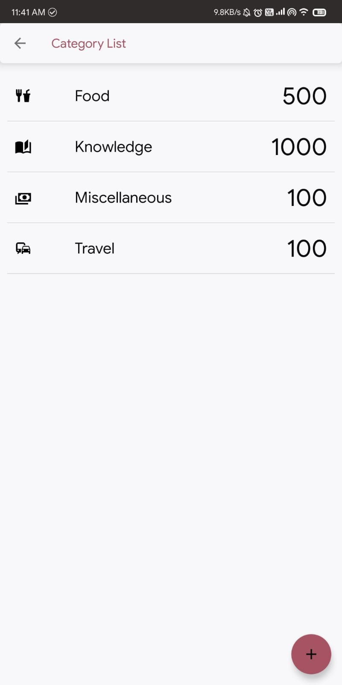
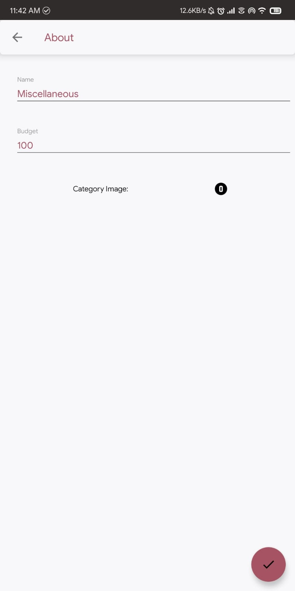
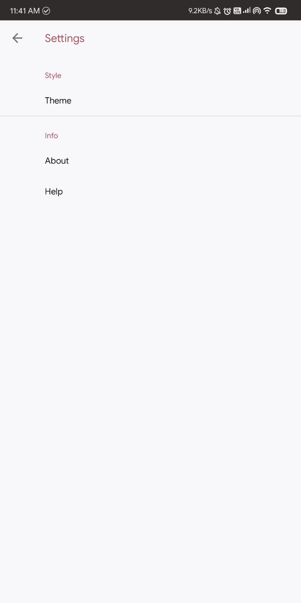
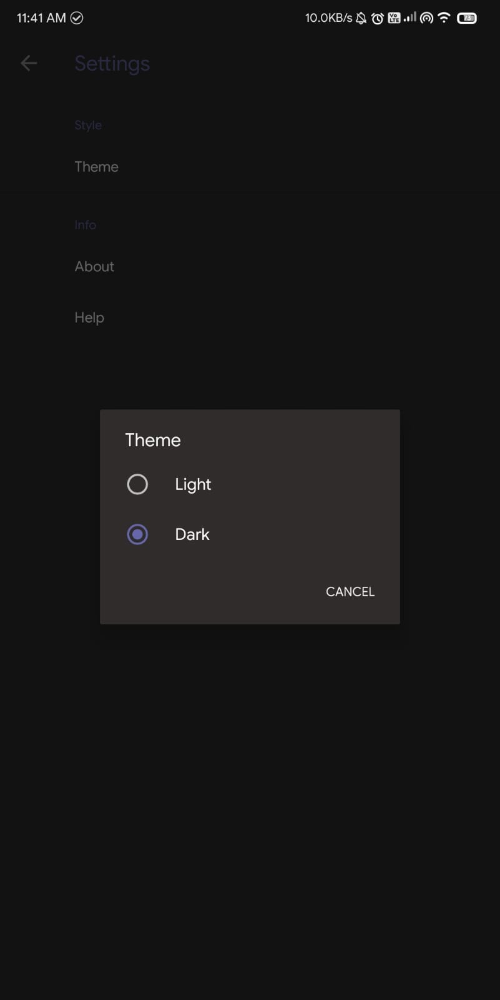

# ExpenseManager

Expense Manager Android App

Budget tracking application which categorizes and provides data based on expenses and budget details. Uses `SQLite` for keeping track in database and `MPAndroidChart`(open source 3rd party library) for visualizing data using graphs,piecharts and more! 

  

Add expense:

 

Add categories and set budgets to keep track of your expenses!

 

Settings and Dark theme support:

 
